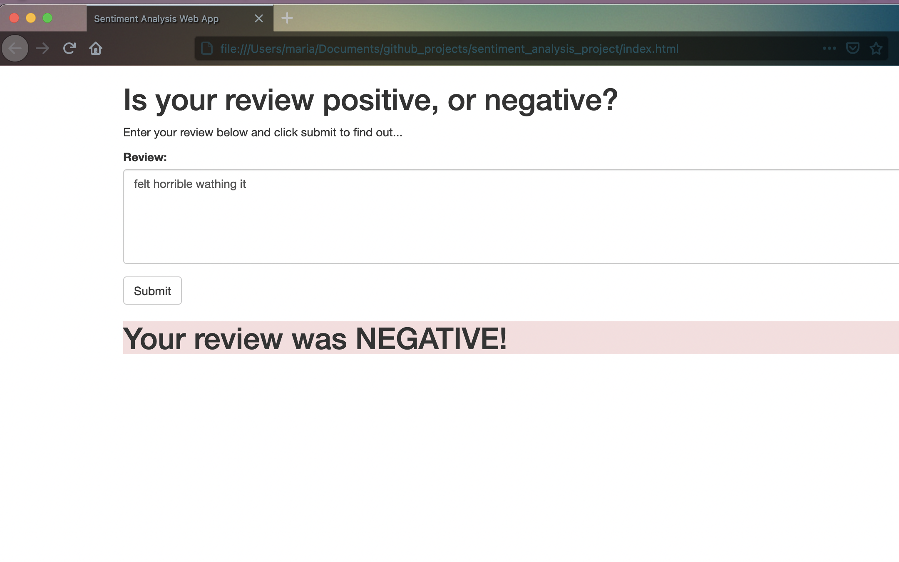
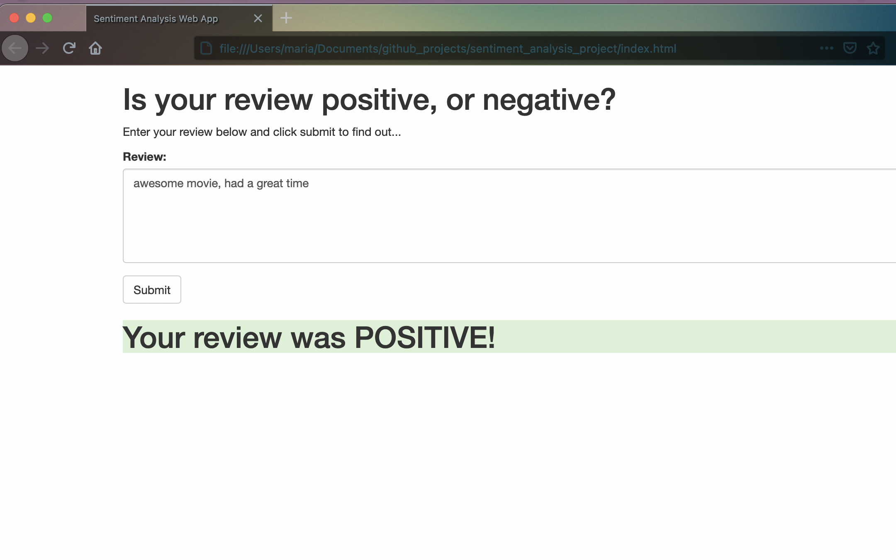

# SageMaker Deployment Project

The notebook and Python files provided here, once completed, result in a simple web app which interacts with a deployed recurrent neural network performing sentiment analysis on movie reviews. This project assumes some familiarity with SageMaker, the mini-project, Sentiment Analysis using XGBoost, should provide enough background.

#### Web app

A simple representation of the web app and its functionality is provided in the two examples below:

*Please find [here](https://github.com/udacity/sagemaker-deployment/tree/master/README.md) instructions on setting up a SageMaker notebook and downloading the project files (as well as the other notebooks).*
